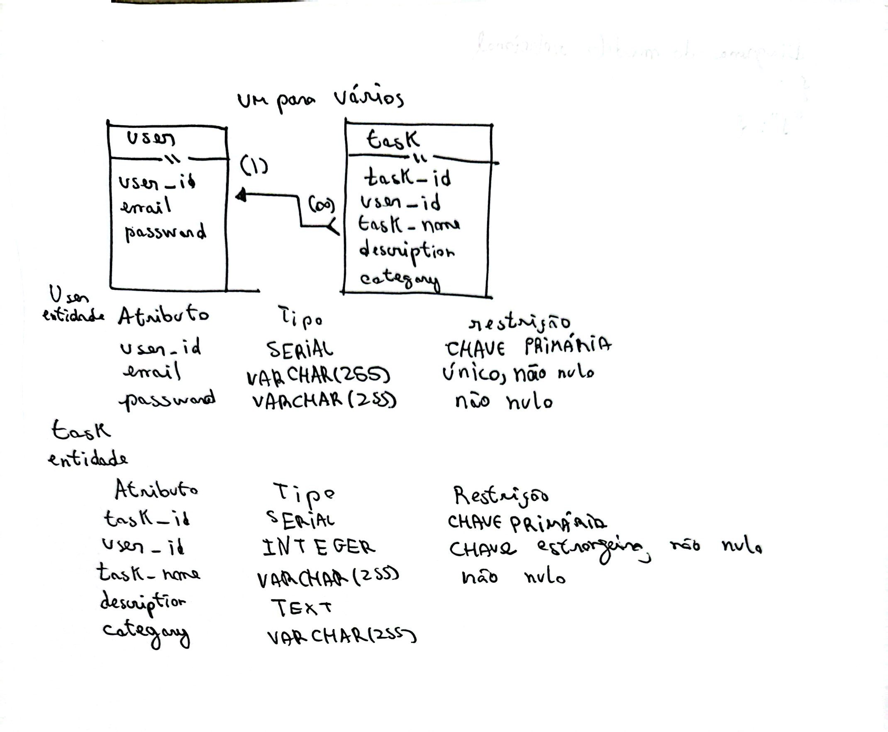

## Tipo de projeto

O projeto usado é um gerenciador de tarefas que adiciona certas tarefas a um
banco de dados e coloca uma categoria e uma descrição à tarefa. O usuário também
terá um e-mail e uma senha, na qual possivelmente no futuro poderá ser implementado
um sistema de cadastro.

## Diagrama do modelo

</img>

## Modelo físico


## Modelo físico
```
-- Create tables
CREATE TABLE users (
    user_id SERIAL PRIMARY KEY,
    email VARCHAR(255) UNIQUE NOT NULL,
    password VARCHAR(255) NOT NULL
);

CREATE TABLE tasks (
    task_id SERIAL PRIMARY KEY,
    user_id INTEGER NOT NULL,
    task_name VARCHAR(255) NOT NULL,
    description TEXT,
    category VARCHAR(255),
    FOREIGN KEY (user_id) REFERENCES users(user_id) ON DELETE CASCADE,
    UNIQUE (user_id, task_name)
);

-- Function to generate JSON structure
CREATE OR REPLACE FUNCTION get_system_json()
RETURNS JSON AS $$
SELECT json_object_agg(
    user_id::TEXT,
    json_build_object(
        'account', json_build_object('email', email, 'password', password),
        'tasks', COALESCE(
            (SELECT json_object_agg(task_name, ARRAY[description, category])
             FROM tasks WHERE tasks.user_id = users.user_id),
            '{}'::json
        )
    )
) AS database
FROM users;
$$ LANGUAGE SQL;

-- Execute with:
-- SELECT get_system_json();
```